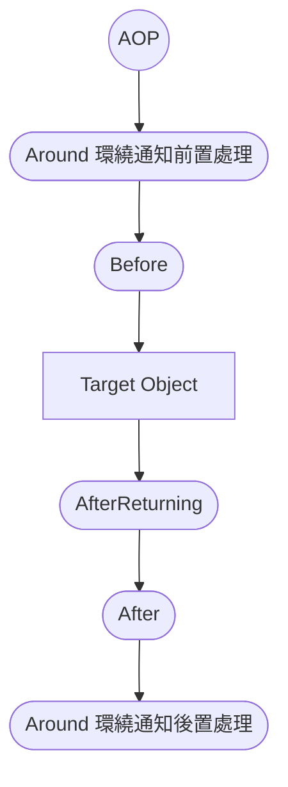

# Spring Boot 2 + Spring 5 + AOP - Demo
### *Learning...* 
## Order
### 單一切面 - 正常情況


```Java
- @Around Before -
@Before Advice 執行 : getEmployeeById 方法開始執行... 
Controller Layer - getEmployeeById method
Service Layer - getEmployeeById method
@AfterReturning Advice 執行 ： getEmployeeById 方法返回值： <200 OK OK,Employee(id=11, firstName=test, lastName=test, email=test@gmail.com),[]>
@After Advice 執行 : getEmployeeById 方法執行結束... 
- @Around After -
```
